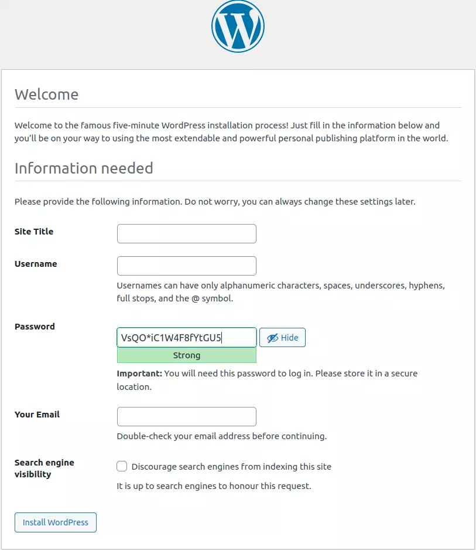

This Vagrantfile was created as I documented it [here](https://silverbullets.co.uk/ci-cd/securing-a-lamp-vps/).

I kept the notes in this README but they were too long and are much better 
presented at the URL above.

Something I distilled before finally purging that README was that I wrote
at length about backup strategies. Logical and physical. Both leave the media
directory not backed up. So I turned my attention to that, through various
endeavours. Ultimately, though, plain `mysqldump` is my go-to backup command.

## What's included

- MySQL
- WordPress
- Apache
- UFW (firewall)
- TLS certificate

## What's not included

- php-imagick
- php-gd

The user ~~must~~ should install either to get image resizing and broader
imaging support.

# README

This repo contains my original Vagrantfile for getting started with WordPress.
I promptly migrated it to Ansible, but that involves a great deal more moving
parts and is less beginner-friendly. Indeed, Vagrant is as close to recording
the manual shell commands and scripts verbatim as any IaC solution I've used.

I've since expanded and refined this into other roles. It was my local
devlopment VM for six months. It's sad there are not cloud providers to test
my Vagrantfile anymore. I have even begun moving it to Docker, as you'll find
in another of my repositories, [wp_app_api](https://github.com/ployt0/wp_app_api/blob/master/.github/workflows/python-app.yml).

I don't know which if any I'll maintain, but making them public might help me
decide.

## Requirements

- vagrant

## Initialisation

- git clone git@github.com:ployt0/wordpress_vagrant.git
- cd wordpress_vagrant
- vagrant up
- vagrant ssh (optional)
- browse to https://localhost:8541 for first setup:

- alternatively save and restore wp-config and the generated sql to bypass
    this manual step. **IMPORTANT** the saved SQL is specific to your host,
    or `site_url`: https://localhost:8541.

## Credentials

- WordPress: nothing, you choose
- MySQL: wordpressabuser/wordpiece
- MySQL root: passwordless, via local shell only

## Test and Operation

Use the `WORDPRESS_VM_SSH_PORT` variable at the top of the Vagrantfile to
connect from your dev machine via ssh.

Whereas, `https://localhost:8541`, is the address for pointing your browser
to the secure site, via port forwarding to 443 inside the VM. Here, WordPress
will prompt you to install it.

